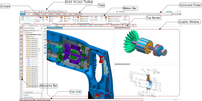

# NXtips
A free collection of tips/tricks, keyboard shortcuts, best practices, for SIEMENS NX.

Feel free to ask questions via Twitter  or [open new issues](https://github.com/Foadsf/NXtips/issues) here on GitHub. Pull requests are also highly welcomed.

## Licence:

## Social:

If you need help for your NX related questione:

* First try asking on [official SIEMENS forums](community.sw.siemens.com)
* There is also a channel for [#siemens-nx](https://discord.gg/YM2SFah) on Elmer's Discord server 
* There is a [Siemens: UG/NX](https://www.eng-tips.com/threadminder.cfm?pid=561) on ENG-TIPS
* If you are part of the VDL ETG you may try the [internal Yammer group](https://www.yammer.com/vdletg.com/#/threads/inGroup?type=in_group&feedId=33947099136&view=all) (you need `@vdletg.com` email address)
* [Siemens NX (Unigraphics) Users](https://grabcad.com/groups/siemens-nx-unigraphics-users/) on GRABCAD

## Keyboard Shortcuts:

### File:

|          Command         |                      Keyboard binding                     |                 ID                 |
|:------------------------:|:---------------------------------------------------------:|:----------------------------------:|
|           Save           |                    <kbd>Ctrl</kbd> + S                    |         `UG_FILE_SAVE_PART`        |
|           Open           |                    <kbd>Ctrl</kbd> + O                    |           `UG_FILE_OPEN`           |
|            New           |                    <kbd>Ctrl</kbd> + N                    |            `UG_FILE_NEW`           |
|          Save as         |          <kbd>Ctrl</kbd> + <kbd>⇧ Shift</kbd> + A         |          `UG_FILE_SAVE_AS`         |
|   Save as new item type  | <kbd>Ctrl</kbd> + <kbd>Alt</kbd> + <kbd>⇧ Shift</kbd> + I |   `UI_FILE_SAVE_AS_NEW_ITEM_TYPE`  |
| Save as non-master parts | <kbd>Ctrl</kbd> + <kbd>Alt</kbd> + <kbd>⇧ Shift</kbd> + N | `UI_FILE_SAVE_AS_NON_MASTER_PARTS` |
|           Plot           |                    <kbd>Ctrl</kbd> + P                    |           `UG_FILE_PLOT`           |
|       Execute-Grip       |                    <kbd>Ctrl</kbd> + G                    |         `UG_FILE_RUN_GRIP`         |
|    Execute-Debug Grip    |          <kbd>Ctrl</kbd> + <kbd>⇧ Shift</kbd> + G         |      `UG_FILE_RUN_GRIP_DEBUG`      |
|      Execute-NXOpen      |                    <kbd>Ctrl</kbd> + U                    |         `UG_FILE_RUN_UFUN`         |

### Edit:

|    Command    |           Keyboard binding           |            ID           |
|:-------------:|:------------------------------------:|:-----------------------:|
|      Undo     |          <kbd>Ctrl</kbd> + Z         |      `UG_EDIT_UNDO`     |
|      Redo     |          <kbd>Ctrl</kbd> + Y         |      `UG_EDIT_REDO`     |
|      Cut      |          <kbd>Ctrl</kbd> + X         |      `UG_EDIT_CUT`      |
|      Copy     |          <kbd>Ctrl</kbd> + C         |      `UG_EDIT_COPY`     |
|     Paste     |          <kbd>Ctrl</kbd> + V         |     `UG_EDIT_PASTE`     |
|     Delete    |          <kbd>Ctrl</kbd> + D         |     `UG_EDIT_DELETE`    |
| Paste special | <kbd>Ctrl</kbd> + <kbd>Alt</kbd> + V | `UG_EDIT_PASTE_SPECIAL` |

### Modeling: 

| Command | Keyboard binding |               ID               |
|:-------:|:----------------:|:------------------------------:|
| Extrude |         X        | `UG_MODELING_EXTRUDED_FEATURE` |

### View

|              Command              |           Keyboard binding           |                 ID                |
|:---------------------------------:|:------------------------------------:|:---------------------------------:|
|               Front               | <kbd>Ctrl</kbd> + <kbd>Alt</kbd> + F |    `UG_VIEW_POPUP_ORIENT_FRONT`   |
|                Top                | <kbd>Ctrl</kbd> + <kbd>Alt</kbd> + T |      `UG_VIEW_POPUP_ORIENT_TOP`   |
|                Left               | <kbd>Ctrl</kbd> + <kbd>Alt</kbd> + L |    `UG_VIEW_POPUP_ORIENT_LEFT`    |
|               Right               | <kbd>Ctrl</kbd> + <kbd>Alt</kbd> + R |    `UG_VIEW_POPUP_ORIENT_RIGHT`   |
|             Trimetric             |            <kbd>Home</kbd>           |   `UG_VIEW_POPUP_ORIENT_TFRTRI`   |
|             Isometric             |            <kbd>End</kbd>            |   `UG_VIEW_POPUP_ORIENT_TFRISO`   |
| Orients the view to active sketch |  <kbd>⇧ Shift</kbd> + <kbd>F8</kbd>  | `UG_SKETCH_ORIENT_VIEW_TO_SKETCH` |
| Snap to the closest standard view |             <kbd>F8</kbd>            |     `UG_VIEW_POPUP_SNAP_VIEW`     |
|                Fit                |         <kbd>Ctrl</kbd> + F          |           `UG_VIEW_FIT`           |
|            WCS display            |                   W                  |          `UG_WCS_DISPLAY`         |
|              Refresh              |             <kbd>F5</kbd>            |       `UG_VIEW_POPUP_REFRESH`     |
|            Edit section           |         <kbd>Ctrl</kbd> + H          |        `UG_VIEW_SECTIONING`       |
|         Toggle full screen        | <kbd>Alt</kbd> + <kbd>⏎ Enter</kbd>  |     `UG_VIEW_FULL_SCREEN_MODE`    |
|                Zoom               |             <kbd>F6</kbd>            |        `UG_VIEW_POPUP_ZOOM`       |
|               Rotate              |             <kbd>F7</kbd>            |       `UG_VIEW_POPUP_ROTATE`      |

### Sketch:

|         Command         |      Keyboard binding     |             ID            |
|:-----------------------:|:-------------------------:|:-------------------------:|
|         Profile         |             Z             |    `UG_SKETCH_PROFILE`    |
|        Rectangle        |             R             |   `UG_SKETCH_RECTANGLE`   |
|           Line          |             L             |      `UG_SKETCH_LINE`     |
|           Arc           |             A             |      `UG_SKETCH_ARC`      |
|          Circle         |             O             |     `UG_SKETCH_CIRCLE`    |
|         Polygon         |             P             |                           |
|      Studio spline      |             S             |                           |
|       Quick   trim      |             T             |                           |
|      Quick   extend     |             E             |                           |
|          Fillet         |             F             |                           |
|    Rapid   dimension    |             D             |                           |
|  Geometric   constrains |             C             |                           |
|     Finish   sketch     |    <kbd>Ctrl</kbd> + Q    | `UG_DIRECT_SKETCH_FINISH` |
|        Duplicate        |   <kbd>Ctrl</kbd> + drag  |                           |
| Move   Orthographically | <kbd>⇧ Shift</kbd> + drag |                           |

* Hold the <kbd>Alt</kbd> key while draging/selecting to turn off the automatic constraint

#### Selection, information, show and hide

|             Action            |      Keyboard binding     |
|:-----------------------------:|:-------------------------:|
|              Hide             |         <kbd>Ctrl</kbd>   + B        |
|      Show   and Hide panel    |         <kbd>Ctrl</kbd>   + W        |
|        Immediate   hide       |     <kbd>Ctrl</kbd>   + <kbd>⇧ Shift</kbd> + I    |
|           Show panel          |     <kbd>Ctrl</kbd>   + <kbd>⇧ Shift</kbd> + K    |
|            Show all           |     <kbd>Ctrl</kbd>   + <kbd>⇧ Shift</kbd> + U    |
|     Invert show and hidden    |     <kbd>Ctrl</kbd>   + <kbd>⇧ Shift</kbd> + B    |
|         Edit   display        |         <kbd>Ctrl</kbd>   + J        |
|      Object   information     |         <kbd>Ctrl</kbd>   + I        |
|      Toggle   WCS display     |              W            |

### Applications:

|         Action        |      Keyboard binding     |
|:---------------------:|:-------------------------:|
|        Modeling       |          <kbd>Ctrl</kbd> + M         |
|       Sheet Metal     |     <kbd>Ctrl</kbd> +   <kbd>⇧ Shift</kbd> + M    |
|        Drafting       |     <kbd>Ctrl</kbd> +   <kbd>⇧ Shift</kbd> + D    |
|         Layout        |     <kbd>Ctrl</kbd> +   <kbd>⇧ Shift</kbd> + Y    |
|     Shape   Studio    |      <kbd>Ctrl</kbd> + <kbd>Alt</kbd>   + S     |

### Others:

|          Action         | Keyboard binding |
|:-----------------------:|:----------------:|
|         Customize       |      <kbd>Ctrl</kbd> + 1    |
|     User   interface    |      <kbd>Ctrl</kbd> + 2    |
|      Layer settings     |     <kbd>Ctrl</kbd> + L     |
|      Expressions     |     <kbd>Ctrl</kbd> + E     |
|      Touch Mode     |     F4     |

## GUI:
<pre>
               
</pre>
